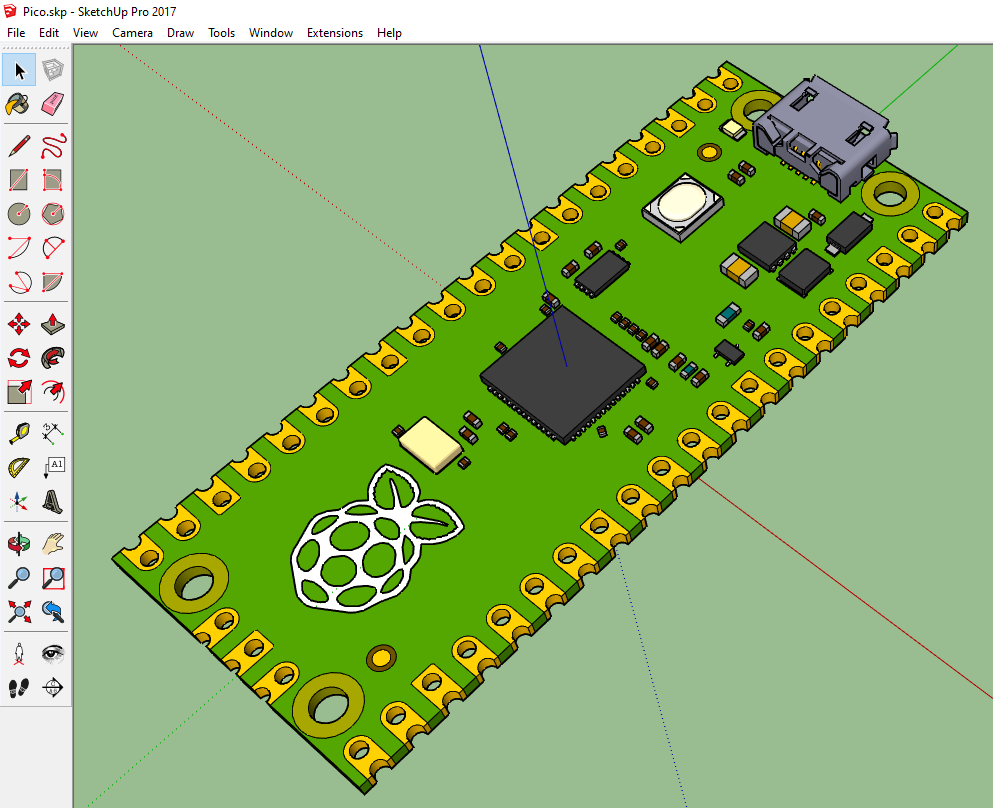

# KiCad-RP-Pico
A simple repository of files needed to add a 3D footprint of the Raspberry Pi Pico board to KiCad.

## Schematic and footprint
I've started from the schematics and footprint files available on the [HeadBoffin RP_Silicon_KiCad GitHub project](https://github.com/HeadBoffin/RP_Silicon_KiCad). Because there are some errors in the readme file on how and where we can get those files from the Raspberry Pi web site, I've copied the needed files here, on the `RP-Pico Libraries` folder. Following the [install instructions](Install%20instructions.md) is possible to add the Raspberry Pi Pico board schema and footprint to a KiCad project:

## 3D Visual
Elas, no visual footprint was available, as we can see on the 3D viewer:

So I decided to create one, using the mechanical specification from the [Raspberry Pi Pico datasheet](https://datasheets.raspberrypi.org/pico/pico-datasheet.pdf):

I've used SketchUp to create the 3D model:

and I used the native Sketchup export function (no plugin needed) to create the VRLM file `Pico.wrl` that I've also added an the  `RP-Pico Libraries` folder, as the VRLM format is one of the 3D model format that KiCad allow to use for the visual rapresentation of a CPB footprint.

## Result

I've created a test project and here is the result:

A tweet with an image of your Raspberry Pi Pico project with a link this project and me (@tpcware) would be greatly appreciated.